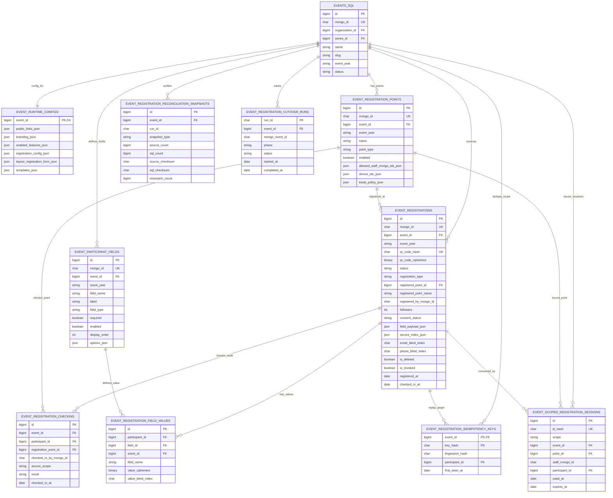
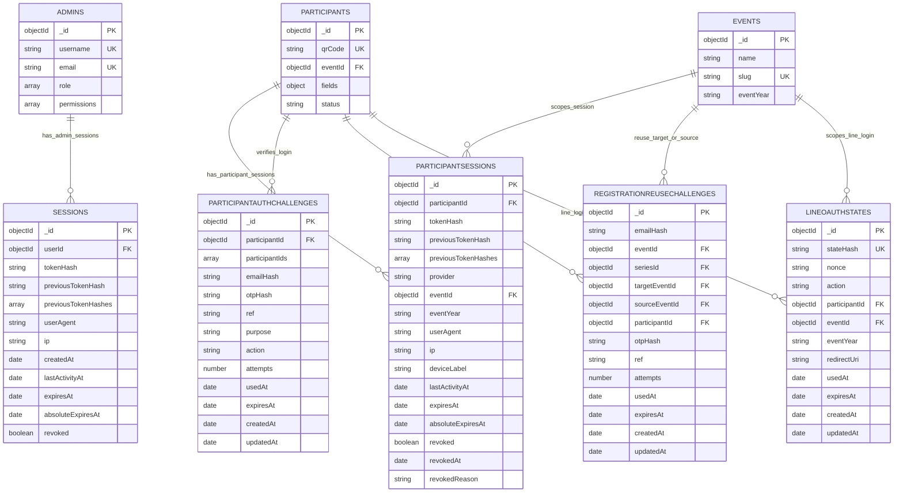
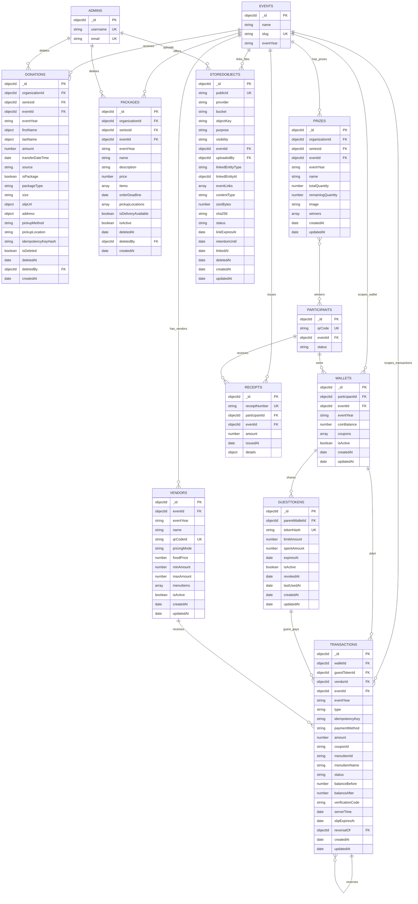
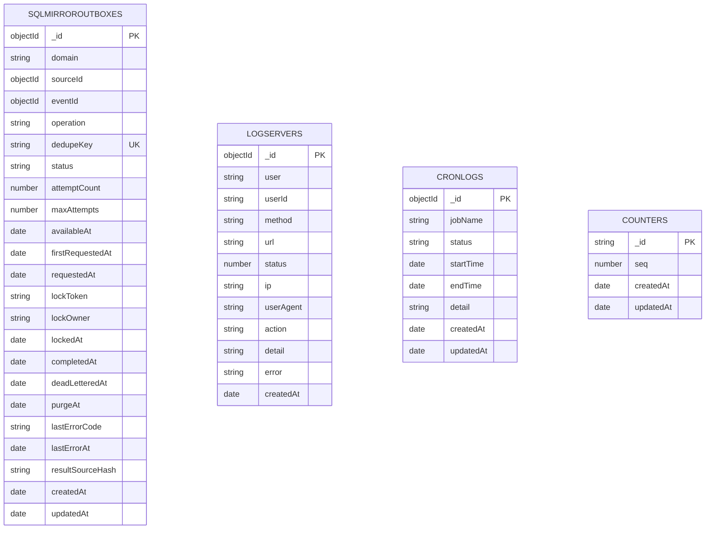

# DBD Mermaid Code

ไฟล์นี้เป็น Mermaid code สำหรับแสดง DBD/ERD โดยใส่ field สำคัญไว้ในแต่ละ table/collection

## 1. Core Event and Registration

```mermaid
erDiagram
  ORGANIZATIONS {
    objectId _id PK
    string name
    string slug UK
    string description
    string status
    object securityPolicy
    object metadata
    date createdAt
    date updatedAt
  }

  EVENTSERIES {
    objectId _id PK
    objectId organizationId FK
    string name
    string slug
    string description
    string status
    string defaultLinkingMode
    object metadata
    date createdAt
    date updatedAt
  }

  EVENTS {
    objectId _id PK
    objectId organizationId FK
    objectId seriesId FK
    string name
    string slug
    string eventYear
    string status
    date startsAt
    date endsAt
    string timezone
    object branding
    object publicLinks
    object publication
    string linkingMode
    array linkedEventIds
    object config
    object layouts
    object templates
    array versionHistory
    date archivedAt
    date activatedAt
    date createdAt
    date updatedAt
  }

  PARTICIPANTFIELDS {
    objectId _id PK
    objectId organizationId FK
    objectId seriesId FK
    objectId eventId FK
    string eventYear
    string name
    string label
    string type
    boolean required
    array options
    number order
    boolean enabled
  }

  REGISTRATIONPOINTS {
    objectId _id PK
    objectId organizationId FK
    objectId seriesId FK
    objectId eventId FK
    string eventYear
    string name
    string description
    string type
    boolean enabled
    array allowedStaff
    array deviceIds
    object kioskPolicy
    date createdAt
    date updatedAt
  }

  PARTICIPANTS {
    objectId _id PK
    string qrCode UK
    object fields
    object secureIndex
    array secureSearch
    objectId organizationId FK
    objectId seriesId FK
    objectId eventId FK
    string eventYear
    array tags
    string status
    date checkedInAt
    date registeredAt
    string certificateVerificationId UK
    string registrationIdempotencyKeyHash
    objectId registeredBy FK
    objectId registeredPointId FK
    string registeredPointName
    boolean isDeleted
    string registrationType
    number followers
    string consent
    object specialAssistance
    boolean isForfeited
    boolean isRevoked
    objectId prizeId FK
    date prizeWonAt
    array authProviders
    string lineUserId
    boolean isLineLinked
    date lastLoginAt
    array trustedDevices
    object notificationPreferences
    date createdAt
    date updatedAt
  }

  ADMINS {
    objectId _id PK
    string username UK
    string passwordHash
    array role
    array permissions
    array organizationIds
    array eventIds
    string email UK
    string fullName
    array registrationPoints
    string avatarUrl
    string googleId
    string resetPasswordOtp
    date resetPasswordExpires
    string actionOtp
    date actionExpires
    boolean mustChangePassword
  }

  SYSTEMSETTINGS {
    objectId _id PK
    string eventName
    objectId defaultOrganizationId FK
    objectId currentEventSeriesId FK
    objectId currentEventId FK
    string currentEventYear
    string eventLinkingMode
    array archivedEventYears
    boolean enableRegister
    boolean maintenanceMode
    boolean enablePickup
    boolean enableDelivery
    string contactEmail
    string welcomeMessage
    date preRegStartDate
    date preRegEndDate
    date kioskStartDate
    date kioskEndDate
    date createdAt
    date updatedAt
  }

  ORGANIZATIONS ||--o{ EVENTSERIES : owns
  ORGANIZATIONS ||--o{ EVENTS : scopes
  EVENTSERIES ||--o{ EVENTS : contains
  EVENTS ||--o{ PARTICIPANTFIELDS : defines_form
  EVENTS ||--o{ REGISTRATIONPOINTS : has_points
  EVENTS ||--o{ PARTICIPANTS : registers
  REGISTRATIONPOINTS ||--o{ PARTICIPANTS : registered_at
  ADMINS ||--o{ PARTICIPANTS : registered_by
  ADMINS }o--o{ ORGANIZATIONS : organization_scope
  ADMINS }o--o{ EVENTS : event_scope
  ADMINS }o--o{ REGISTRATIONPOINTS : assigned_points
  ORGANIZATIONS ||--o{ SYSTEMSETTINGS : default_scope
  EVENTSERIES ||--o{ SYSTEMSETTINGS : current_series
  EVENTS ||--o{ SYSTEMSETTINGS : current_event
```

## 1.1 MariaDB Event Registration Primary-Ready

## 2. Authentication and Challenge DB

## 3. Event Operation, Wallet, and File DB

## 4. System, Audit, and Mirror Queue DB

## 5. SQL Reporting Mirror DB

```mermaid
erDiagram
  organizations {
    bigint id PK
    string mongo_id UK
    string name
    string slug UK
    string status
    json security_policy_json
    datetime source_created_at
    datetime source_updated_at
    datetime mirrored_at
    string source_hash
  }

  event_series {
    bigint id PK
    string mongo_id UK
    bigint organization_id FK
    string name
    string slug
    string status
    string default_linking_mode
    datetime source_created_at
    datetime source_updated_at
    datetime mirrored_at
    string source_hash
  }

  events {
    bigint id PK
    string mongo_id UK
    bigint organization_id FK
    bigint series_id FK
    string name
    string slug
    string event_year
    string status
    datetime starts_at
    datetime ends_at
    string timezone
    string linking_mode
    datetime archived_at
    datetime activated_at
    datetime source_created_at
    datetime source_updated_at
    datetime mirrored_at
    string source_hash
  }

  participants_core {
    bigint id PK
    string mongo_id UK
    bigint organization_id FK
    bigint series_id FK
    bigint event_id FK
    string event_year
    string qr_code UK
    string status
    string registration_type
    string registered_point_name
    number followers
    string consent_status
    string email_blind_index
    string phone_blind_index
    string name_blind_index
    string line_user_blind_index
    boolean is_line_linked
    boolean is_deleted
    boolean is_revoked
    datetime registered_at
    datetime checked_in_at
    datetime source_updated_at
    datetime mirrored_at
    string source_hash
  }

  wallets {
    bigint id PK
    string mongo_id UK
    bigint participant_id FK
    bigint event_id FK
    string event_year
    string event_scope_key
    bigint coin_balance
    boolean is_active
    datetime source_created_at
    datetime source_updated_at
    datetime mirrored_at
    string source_hash
  }

  wallet_coupons {
    bigint id PK
    bigint wallet_id FK
    string coupon_id
    string name
    bigint quantity
    datetime mirrored_at
  }

  vendors {
    bigint id PK
    string mongo_id UK
    bigint event_id FK
    string event_year
    string name
    string qr_code_id UK
    string pricing_mode
    bigint fixed_price
    bigint min_amount
    bigint max_amount
    boolean is_active
    datetime source_created_at
    datetime source_updated_at
    datetime mirrored_at
    string source_hash
  }

  vendor_menu_items {
    bigint id PK
    bigint vendor_id FK
    number source_index
    string item_id
    string name
    bigint price
    boolean is_active
    datetime mirrored_at
  }

  wallet_transactions {
    bigint id PK
    string mongo_id UK
    bigint wallet_id FK
    bigint vendor_id FK
    bigint event_id FK
    string guest_token_mongo_id
    string reversal_of_mongo_id
    bigint reversal_of_id FK
    string transaction_type
    string idempotency_key
    string payment_method
    bigint amount
    string coupon_id
    string menu_item_id
    string menu_item_name
    string status
    bigint balance_before
    bigint balance_after
    bigint item_balance_before
    bigint item_balance_after
    string verification_code
    datetime server_time
    datetime slip_expires_at
    datetime mirrored_at
    string source_hash
  }

  receipts {
    bigint id PK
    string mongo_id UK
    string receipt_number UK
    bigint participant_id FK
    bigint event_id FK
    decimal amount
    string details_hash
    datetime issued_at
    datetime mirrored_at
    string source_hash
  }

  donation_summaries {
    bigint id PK
    string mongo_id UK
    bigint organization_id FK
    bigint series_id FK
    bigint event_id FK
    string event_year
    decimal amount
    datetime transfer_at
    string source
    boolean is_package
    string package_type
    string pickup_method
    boolean is_deleted
    datetime source_created_at
    datetime mirrored_at
    string source_hash
  }

  packages {
    bigint id PK
    string mongo_id UK
    bigint organization_id FK
    bigint series_id FK
    bigint event_id FK
    string event_year
    string name
    string description
    decimal price
    datetime order_deadline
    boolean is_delivery_available
    boolean is_active
    datetime deleted_at
    datetime source_created_at
    datetime mirrored_at
    string source_hash
  }

  package_items {
    bigint id PK
    bigint package_id FK
    number source_index
    string item_name
  }

  package_variants {
    bigint id PK
    bigint package_item_id FK
    number source_index
    string size_label
    bigint stock
    bigint sold
  }

  mirror_backfill_checkpoints {
    string domain_name PK
    string run_id
    string mapper_version
    string high_watermark_mongo_id
    string last_mongo_id
    bigint processed_count
    string last_source_hash
    string source_checksum
    datetime completed_at
    datetime updated_at
  }

  organizations ||--o{ event_series : owns
  organizations ||--o{ events : scopes
  event_series ||--o{ events : contains
  organizations ||--o{ participants_core : scopes
  event_series ||--o{ participants_core : scopes
  events ||--o{ participants_core : registers
  participants_core ||--o{ wallets : owns
  events ||--o{ wallets : scopes
  wallets ||--o{ wallet_coupons : has
  events ||--o{ vendors : has
  vendors ||--o{ vendor_menu_items : has
  wallets ||--o{ wallet_transactions : pays
  vendors ||--o{ wallet_transactions : receives
  events ||--o{ wallet_transactions : scopes
  wallet_transactions ||--o{ wallet_transactions : reverses
  participants_core ||--o{ receipts : receives
  events ||--o{ receipts : issues
  organizations ||--o{ donation_summaries : scopes
  event_series ||--o{ donation_summaries : scopes
  events ||--o{ donation_summaries : receives
  organizations ||--o{ packages : scopes
  event_series ||--o{ packages : scopes
  events ||--o{ packages : offers
  packages ||--o{ package_items : has
  package_items ||--o{ package_variants : has
```

## 6. Planned POS and Inventory DB

```mermaid
erDiagram
  PosLocations {
    objectId _id PK
    objectId organizationId FK
    objectId eventId FK
    objectId vendorId FK
    string name
    string code
    string status
    string timezone
    string cashPolicy
    string negativeStockPolicy
  }

  PosTerminals {
    objectId _id PK
    objectId organizationId FK
    objectId eventId FK
    objectId locationId FK
    objectId vendorId FK
    string terminalCode
    string deviceId
    string status
    date lastSeenAt
  }

  PosDeviceSessions {
    objectId _id PK
    objectId terminalId FK
    string deviceId
    objectId userId FK
    objectId shiftId FK
    string status
    number tokenVersion
    date expiresAt
    date revokedAt
  }

  PosShifts {
    objectId _id PK
    objectId organizationId FK
    objectId eventId FK
    objectId vendorId FK
    objectId locationId FK
    objectId terminalId FK
    objectId cashierId FK
    objectId managerId FK
    string status
    string businessDate
    number cashFloatMinor
    string cashPolicy
    date openedAt
    date acknowledgedAt
    date submittedAt
    date approvedAt
    number version
  }

  ShiftCloseSubmissions {
    objectId _id PK
    objectId shiftId FK
    objectId submittedBy FK
    object denominations
    number declaredCashMinor
    number declaredFloatMinor
    number declaredPromptPayAmountMinor
    number declaredCardAmountMinor
    object manifestSummary
    string status
    number version
    date submittedAt
  }

  ShiftReconciliationFindings {
    objectId _id PK
    objectId shiftId FK
    string code
    string severity
    number amountDeltaMinor
    number countDelta
    objectId ownerId FK
    string status
    date dueDate
    date resolvedAt
    string resolutionNote
  }

  Products {
    objectId _id PK
    objectId organizationId FK
    objectId eventId FK
    objectId vendorId FK
    string name
    string category
    string status
    object taxPolicy
    object metadata
  }

  ProductVariants {
    objectId _id PK
    objectId productId FK
    string sku UK
    string barcode UK
    string name
    number priceMinor
    number costMinor
    string unit
    boolean trackStock
    string stockPolicy
    string status
    number version
  }

  InventoryBalances {
    objectId _id PK
    objectId organizationId FK
    objectId eventId FK
    objectId locationId FK
    objectId variantId FK
    number onHandQty
    number allocatedQty
    number availableQty
    number version
    date updatedAt
  }

  InventoryMovements {
    objectId _id PK
    objectId organizationId FK
    objectId eventId FK
    objectId locationId FK
    objectId variantId FK
    string type
    number quantityDelta
    string unit
    string sourceType
    objectId sourceId
    objectId actorId FK
    string reason
    string idempotencyKeyHash
    date createdAt
  }

  StockReservations {
    objectId _id PK
    objectId organizationId FK
    objectId eventId FK
    objectId locationId FK
    objectId variantId FK
    string sourceType
    objectId sourceId
    number quantity
    string status
    date expiresAt
    date committedAt
    date releasedAt
  }

  PosOrders {
    objectId _id PK
    objectId organizationId FK
    objectId eventId FK
    objectId vendorId FK
    objectId locationId FK
    objectId terminalId FK
    objectId shiftId FK
    objectId cashierId FK
    string orderNumber UK
    string businessDate
    string status
    array lines
    number totalMinor
    string currency
    string pricingPolicyVersion
    boolean hasNegativeStockOverride
    string idempotencyKeyHash
    number version
  }

  PosPayments {
    objectId _id PK
    objectId orderId FK
    string provider
    string paymentMethod
    string status
    number amountMinor
    string currency
    string providerPaymentId
    number estimatedFeeMinor
    number actualFeeMinor
    number netSettlementMinor
    date paidAt
    string idempotencyKeyHash
  }

  PaymentProviderEvents {
    objectId _id PK
    string provider
    string providerEventId UK
    objectId paymentId FK
    objectId orderId FK
    string payloadHash
    string status
    date receivedAt
    date processedAt
    string dedupeKey UK
  }

  ESlipRecords {
    objectId _id PK
    objectId organizationId FK
    objectId eventId FK
    objectId orderId FK
    objectId paymentId FK
    string receiptNumber UK
    string verificationId UK
    string objectRef
    string checksum
    string objectGeneration
    string status
    date issuedAt
  }

  Suppliers {
    objectId _id PK
    objectId organizationId FK
    string name
    string code UK
    object contact
    string taxId
    string status
    object secureIndex
    object metadata
  }

  PurchaseOrders {
    objectId _id PK
    objectId organizationId FK
    objectId eventId FK
    objectId locationId FK
    objectId supplierId FK
    string poNumber UK
    string status
    string currency
    array lines
    number orderedAmountMinor
    objectId approvedBy FK
    date approvedAt
    date expectedDate
    number version
  }

  GoodsReceipts {
    objectId _id PK
    objectId purchaseOrderId FK
    objectId organizationId FK
    objectId eventId FK
    objectId locationId FK
    string supplierDocumentNo
    array lines
    objectId receivedBy FK
    date receivedAt
    string status
    string idempotencyKeyHash
  }

  AccountsPayableEntries {
    objectId _id PK
    objectId supplierId FK
    objectId purchaseOrderId FK
    objectId goodsReceiptId FK
    string invoiceNo
    string status
    number totalPayableAmountMinor
    number paidAmountMinor
    date dueDate
    date createdAt
  }

  ManagerAlerts {
    objectId _id PK
    objectId organizationId FK
    objectId eventId FK
    string severity
    string code
    string sourceType
    objectId sourceId
    objectId recipientAdminId FK
    string channel
    string status
    string dedupeKey UK
    date createdAt
    date sentAt
  }

  IdempotencyRecords {
    objectId _id PK
    string scope
    string keyHash UK
    string requestHash
    string aggregateType
    objectId aggregateId
    string status
    object responseSummary
    date expiresAt
    date createdAt
  }

  PosLocations ||--o{ PosTerminals : has_terminals
  PosTerminals ||--o{ PosDeviceSessions : has_device_sessions
  PosLocations ||--o{ PosShifts : hosts_shifts
  PosTerminals ||--o{ PosShifts : assigned_to_shift
  PosShifts ||--o{ ShiftCloseSubmissions : close_submissions
  PosShifts ||--o{ ShiftReconciliationFindings : findings
  Products ||--o{ ProductVariants : has_variants
  ProductVariants ||--o{ InventoryBalances : has_balances
  ProductVariants ||--o{ InventoryMovements : movement_ledger
  ProductVariants ||--o{ StockReservations : reserves_stock
  PosShifts ||--o{ PosOrders : sells_orders
  PosOrders ||--o{ PosPayments : paid_by
  PosPayments ||--o{ PaymentProviderEvents : confirmed_by_provider
  PosOrders ||--o{ ESlipRecords : issues_eslip
  Suppliers ||--o{ PurchaseOrders : receives_po
  PurchaseOrders ||--o{ GoodsReceipts : receives_goods
  GoodsReceipts ||--o{ AccountsPayableEntries : creates_ap
  ShiftReconciliationFindings ||--o{ ManagerAlerts : notifies
```

