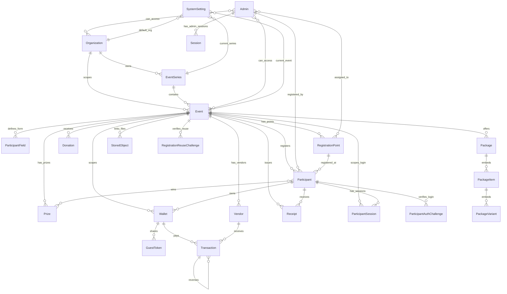
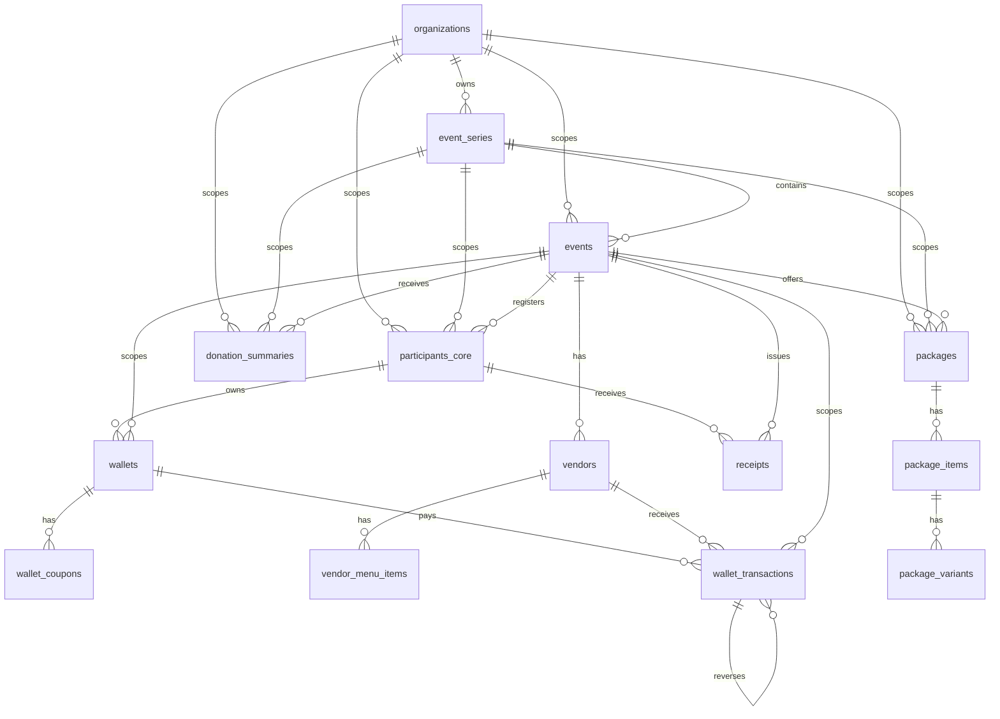

# Event Structural DBD and Registration Readiness

ตรวจจาก source code ใน repository ณวันที่ 2026-08-14 เวลาโซน Asia/Bangkok

เอกสารนี้สรุป Database Design แบบ structural DBD, ความสัมพันธ์ของแต่ละ collection/table และ checklist ฟังก์ชันที่เกี่ยวกับงานอีเวนต์/การลงทะเบียน โดยอ้างอิงจาก:

- `backend/src/models/*.js`
- `backend/src/routes/*.js`
- `backend/src/controllers/*.js`
- `backend/src/sql/migrations/001_initial_reporting_mirror.js`
- `frontend/src/App.jsx`
- `frontend/src/utils/api.js`
- `docs/MULTI_EVENT_OPERATION.md`

## 1. ภาพรวมฐานข้อมูล

ระบบใช้ MongoDB เป็น operational primary database ผ่าน Mongoose models สำหรับ domain หลักส่วนใหญ่ และมี MariaDB/MySQL สำหรับ reporting mirror รวมถึง event-registration primary path แบบแยก flag

- Operational DB: MongoDB collections เช่น `events`, `participants`, `donations`, `wallets`
- Reporting/SQL DB: MariaDB/MySQL tables เช่น `events`, `participants_core`, `wallet_transactions`
- Event Registration cutover: เปิดเฉพาะ registration domain ได้ด้วย `SQL_EVENT_REGISTRATION_PRIMARY=true`
- Global primary cutover: `SQL_PRIMARY_STORE` ยังต้องเป็น `false` จนกว่า POS/SSO/session/wallet/prize และ domain อื่นผ่าน repository cutover ครบ

## 2. Structural DBD: Operational MongoDB

## 3. Operational Collections

| Collection | หน้าที่หลัก | Key fields | ความสัมพันธ์ |
|---|---|---|---|
| `organizations` | หน่วยงาน/เจ้าของกิจกรรม | `name`, `slug`, `status`, `securityPolicy` | 1 organization มีหลาย `event_series` และ `events` |
| `eventseries` | ชุดกิจกรรมต่อเนื่อง | `organizationId`, `name`, `slug`, `defaultLinkingMode` | อ้าง `Organization`; 1 series มีหลาย `events` |
| `events` | รอบกิจกรรมจริง | `organizationId`, `seriesId`, `slug`, `eventYear`, `status`, `branding`, `config`, `layouts` | อ้าง `Organization`, `EventSeries`, `Admin`; เป็น root scope ของข้อมูลอีเวนต์ |
| `participantfields` | field ฟอร์มลงทะเบียนต่อ event | `eventId`, `name`, `label`, `type`, `required`, `enabled`, `order` | อ้าง `Organization`, `EventSeries`, `Event` |
| `registrationpoints` | จุดลงทะเบียน/คีออสก์/เช็คอิน | `eventId`, `name`, `type`, `enabled`, `allowedStaff`, `kioskPolicy` | อ้าง `Event`, `Admin`; ถูกใช้โดย `participants.registeredPointId` |
| `participants` | ผู้เข้าร่วม | `qrCode`, `fields`, `secureIndex`, `eventId`, `status`, `registrationType`, `checkedInAt` | อ้าง `Event`, `RegistrationPoint`, `Admin`, `Prize` |
| `registrationreusechallenges` | OTP สำหรับดึงข้อมูลลงทะเบียนเดิม | `emailHash`, `targetEventId`, `sourceEventId`, `participantId`, `expiresAt` | อ้าง `EventSeries`, `Event`, `Participant` |
| `participantauthchallenges` | OTP login/step-up ของ participant | `participantId`, `participantIds`, `emailHash`, `purpose`, `expiresAt` | อ้าง `Participant` |
| `participantsessions` | session participant | `participantId`, `eventId`, `provider`, `expiresAt`, `revoked` | อ้าง `Participant`, `Event` |
| `lineoauthstates` | state/nonce ของ LINE OAuth | `stateHash`, `action`, `participantId`, `eventId`, `expiresAt` | อ้าง `Participant`, `Event` |
| `admins` | ผู้ดูแล/เจ้าหน้าที่ | `username`, `email`, `role`, `permissions`, `organizationIds`, `eventIds`, `registrationPoints` | อ้าง `Organization`, `Event`, `RegistrationPoint` |
| `sessions` | session ผู้ดูแล | `userId`, `tokenHash`, `expiresAt`, `revoked` | อ้าง `Admin` |
| `systemsettings` | ค่า current/default สำหรับ legacy/global views | `defaultOrganizationId`, `currentEventSeriesId`, `currentEventId`, `currentEventYear` | อ้าง `Organization`, `EventSeries`, `Event` |
| `donations` | รายการสนับสนุน/แพ็กเกจ | `eventId`, `amount`, `source`, `isPackage`, `packageType`, `pickupMethod`, `slipUrl` | อ้าง `Organization`, `EventSeries`, `Event`, `Admin` |
| `packages` | แพ็กเกจและ stock แบบ embedded | `eventId`, `name`, `price`, `items.sizes.stock`, `items.sizes.sold` | อ้าง `Organization`, `EventSeries`, `Event`, `Admin` |
| `prizes` | ของรางวัลและผู้ชนะ | `eventId`, `name`, `totalQuantity`, `remainingQuantity`, `winners.participantId` | อ้าง `Organization`, `EventSeries`, `Event`, `Participant` |
| `wallets` | wallet/coupon ของ participant | `participantId`, `eventId`, `coinBalance`, `coupons` | อ้าง `Participant`, `Event` |
| `guesttokens` | token แชร์ wallet | `parentWalletId`, `tokenHash`, `limitAmount`, `expiresAt` | อ้าง `Wallet` |
| `vendors` | ร้านค้า/จุดรับชำระ | `eventId`, `qrCodeId`, `pricingMode`, `menuItems` | อ้าง `Event`; ถูกใช้โดย `transactions.vendorId` |
| `transactions` | รายการจ่าย/refund/reversal | `walletId`, `vendorId`, `guestTokenId`, `eventId`, `type`, `amount`, `reversalOf` | อ้าง `Wallet`, `Vendor`, `GuestToken`, `Event`, `Transaction` |
| `receipts` | ใบเสร็จ | `receiptNumber`, `participantId`, `eventId`, `amount` | อ้าง `Participant`, `Event` |
| `storedobjects` | ไฟล์ใน local/GCS | `publicId`, `provider`, `purpose`, `eventId`, `uploadedBy`, `eventLinks` | อ้าง `Event`, `Admin`; link entity ผ่าน `linkedEntityType` |
| `sqlmirroroutboxes` | outbox สำหรับ SQL mirror | `domain`, `sourceId`, `eventId`, `status`, `dedupeKey` | เก็บ queue สำหรับ mirror domain |
| `logservers` | audit/API log | `user`, `userId`, `method`, `url`, `action`, `createdAt` | ไม่มี FK; มี TTL |
| `cronlogs` | log งาน cron | `jobName`, `status`, `startTime`, `endTime` | ไม่มี FK |
| `counters` | sequence counter | `_id`, `seq` | ใช้สร้างเลข running |

## 4. Structural DBD: SQL Reporting Mirror

SQL mirror มี foreign key จริงเพื่อให้รายงาน/BI join ได้ชัดเจน แต่ข้อมูลต้นทางยังมาจาก MongoDB

## 5. SQL Mirror Tables

| Table | หน้าที่ | Foreign keys |
|---|---|---|
| `organizations` | mirror ของ organization | - |
| `event_series` | mirror ของ event series | `organization_id -> organizations.id` |
| `events` | mirror ของ event | `organization_id -> organizations.id`, `series_id -> event_series.id` |
| `participants_core` | participant reporting แบบไม่เก็บ plaintext PII | `organization_id`, `series_id`, `event_id` |
| `wallets` | wallet summary | `participant_id -> participants_core.id`, `event_id -> events.id` |
| `wallet_coupons` | coupon ใน wallet | `wallet_id -> wallets.id` |
| `vendors` | vendor summary | `event_id -> events.id` |
| `vendor_menu_items` | menu items ของ vendor | `vendor_id -> vendors.id` |
| `wallet_transactions` | payment/refund/reversal | `wallet_id`, `vendor_id`, `event_id`, `reversal_of_id` |
| `receipts` | receipt summary | `participant_id -> participants_core.id`, `event_id -> events.id` |
| `donation_summaries` | donation/package summary | `organization_id`, `series_id`, `event_id` |
| `packages` | package summary | `organization_id`, `series_id`, `event_id` |
| `package_items` | item ใน package | `package_id -> packages.id` |
| `package_variants` | size/stock/sold ใน package item | `package_item_id -> package_items.id` |
| `mirror_backfill_checkpoints` | checkpoint งาน backfill | - |

## 6. ความสัมพันธ์สำคัญสำหรับ Flow ลงทะเบียน

1. Public route `/e/:eventSlug/register` เรียก event ด้วย `Event.slug` แล้ว backend เขียน `organizationId`, `seriesId`, `eventId`, `eventYear` ลง `Participant`
2. ฟอร์มลงทะเบียนอ่าน field จาก `ParticipantField` โดย scope ตาม `eventId` และ fallback legacy field ได้
3. การลงทะเบียน public/staff/kiosk/self-register ใช้ `Participant.registrationType` แยกชนิดข้อมูล
4. `Participant.qrCode` เป็น unique key สำหรับ e-ticket และ check-in
5. Check-in เปลี่ยน `Participant.status` เป็น `checkedIn` และบันทึก `checkedInAt`
6. จุดลงทะเบียนใช้ `RegistrationPoint` และตรวจ `allowedStaff`, `deviceIds`, `kioskPolicy`
7. การลงทะเบียนซ้ำใช้ idempotency hash ต่อ `eventId` เพื่อป้องกัน submit ซ้ำ
8. การดึงข้อมูลลงทะเบียนเดิมใช้ `RegistrationReuseChallenge` พร้อม OTP
9. การส่ง ticket ซ้ำใช้ข้อมูล participant ใน scope event และตอบแบบ generic เพื่อไม่เปิดเผยว่ามีข้อมูลหรือไม่
10. Dashboard/report/public report อ่านจาก `Participant`, `Donation`, `Prize`, `Package` โดยใช้ event scope

## 7. Checklist ฟังก์ชันงานอีเวนต์และสถานะพร้อมลงทะเบียน

สถานะ:

- `เสร็จ`: มี route/controller/frontend page หรือ utility รองรับแล้ว
- `พร้อมหลัง config`: โค้ดพร้อม แต่ต้องตั้งค่า environment, provider หรือข้อมูล event ก่อนใช้งานจริง
- `ยังไม่เสร็จ`: พบใน requirement/roadmap แต่ยังไม่พบ implementation ครบใน code path ปัจจุบัน

| กลุ่มงาน | ฟังก์ชัน | สถานะ | วันที่พร้อมสำหรับเปิดลงทะเบียน | หมายเหตุ |
|---|---|---|---|---|
| Event setup | Organization/Event Series/Event CRUD | เสร็จ | 2026-08-14 | ใช้ `/api/events/*` และหน้า `/admin/events` |
| Event setup | Event workspace หลัง login | เสร็จ | 2026-08-14 | มี `/workspace` และ `/admin/events/:eventId/*` |
| Event lifecycle | draft/publish/registration_open/closed/event_day/archive | เสร็จ | 2026-08-14 | ก่อนเปิดรับต้องตั้ง status เป็น `registration_open` |
| Event settings | Branding, logo, cover, colors, contact, welcome message | เสร็จ | 2026-08-14 | มีหน้า event settings |
| Layout | Landing/registration/dashboard/ticket/report layout | เสร็จ | 2026-08-14 | มี version history/publish snapshot |
| Registration | Public landing `/e/:slug` | เสร็จ | 2026-08-14 | แสดงเฉพาะ event ที่ public ได้ |
| Registration | Public registration `/e/:slug/register` | เสร็จ | 2026-08-14 | ต้องเปิด feature `registration` และช่วงเวลา |
| Registration | Dynamic participant fields | เสร็จ | 2026-08-14 | ใช้ `ParticipantField` ต่อ event |
| Registration | Idempotency submit ซ้ำ | เสร็จ | 2026-08-14 | เก็บ hash ต่อ event |
| Registration | Turnstile/rate limit/CSRF guard | พร้อมหลัง config | 2026-08-14 | production ต้องมี Turnstile key และ hostname allowlist |
| Registration | Reuse registration จาก event เดิมด้วย OTP | เสร็จ | 2026-08-14 | ต้องมี Brevo Email provider หรือ approved SMTP fallback |
| Registration | Resend e-ticket | เสร็จ | 2026-08-14 | public และ staff endpoint พร้อม |
| Onsite | Staff registration | เสร็จ | 2026-08-14 | ใช้ scoped permission และ registration point |
| Onsite | Kiosk token/join/diagnostic | เสร็จ | 2026-08-14 | ต้องสร้าง token จาก staff/admin |
| Onsite | Self-register link/short session | เสร็จ | 2026-08-14 | ใช้ QR/link เฉพาะจุดลงทะเบียน |
| Onsite | Check-in by QR | เสร็จ | 2026-08-14 | staff/kiosk เท่านั้น |
| Participant ops | List/search/update/delete/restore prize right | เสร็จ | 2026-08-14 | ต้องมี permission `participant:manage` |
| Participant ops | CSV/PDF export พร้อม audit | เสร็จ | 2026-08-14 | ต้องมี permission `participant:export` |
| Dashboard/report | Admin dashboard summary/comparison | เสร็จ | 2026-08-14 | ใช้ event scope |
| Dashboard/report | Public report/dashboard แบบ privacy-aware | เสร็จ | 2026-08-14 | มี masking/aggregation |
| Donation/package | Donation, slip upload, package stock reserve/release | พร้อมหลัง config | 2026-08-14 | ต้องเปิด feature `donations/packages`; GCS/local storage ต้องพร้อม |
| Prize | Lucky draw และ public lucky draw | เสร็จ | 2026-08-14 | ใช้ participant ที่ eligible ใน event scope |
| Certificate | Verify/download certificate | เสร็จ | 2026-08-14 | feature `certificate`; admin UI rotate ID ยังไม่ครบ |
| Participant account | Email OTP login/profile/session security | พร้อมหลัง config | 2026-08-14 | ต้องมี Brevo Email provider หรือ approved SMTP fallback |
| LINE/LIFF | LINE login/link/unlink/callback | พร้อมหลัง config | 2026-08-14 | ต้องตั้ง LINE channel/env |
| Wallet | Wallet balance/guest wallet/vendor payment | พร้อมหลัง config | 2026-08-15 | ต้อง seed wallet/vendor และตั้ง vendor QR secret |
| Receipt | Generate receipt | เสร็จ | 2026-08-14 | admin endpoint พร้อม |
| Admin/security | Admin CRUD, roles, permissions, session revoke, OTP action | เสร็จ | 2026-08-14 | superadmin/security policy ต้องกำหนดจริง |
| Storage | Event media/payment slip/avatar managed object | พร้อมหลัง config | 2026-08-14 | local ใช้ได้, production GCS ต้องตั้ง bucket/policy |
| SQL reporting mirror / Event Registration primary | DDL, mapper, outbox, backfill checkpoint, registration SQL repository | พร้อมหลัง config | 2026-08-15 | เปิดเฉพาะ `SQL_EVENT_REGISTRATION_PRIMARY=true` ได้หลัง backfill/reconciliation; ยังต้องคง `SQL_PRIMARY_STORE=false` |
| Production deployment | Plesk/Cloud Run readiness และ smoke test | พร้อมหลัง config | 2026-08-15 | ต้องยืนยัน `/health/ready`, SPA route และ API route จริง |
| Production data migration | MongoDB production migration/cutover | ยังไม่เสร็จ | TBD หลังมี maintenance, backup, restore evidence | ไม่ควรทำก่อนหลักฐาน production พร้อมครบ |
| POS/Inventory/PO | Cloud POS, inventory ledger, PO, AP | ยังไม่เสร็จ | หลังเฟสลงทะเบียน | มี PRD/requirements แต่ไม่พบ implementation ครบใน models/routes ปัจจุบัน |

## 8. สรุปความพร้อมเปิดลงทะเบียน

โค้ดสำหรับเปิดลงทะเบียน event-scoped พร้อมใช้งานแล้วในระดับ application ตั้งแต่ 2026-08-14 โดย flow หลักครบ: สร้าง event, publish, เปิดรับลงทะเบียน, dynamic fields, public registration, staff/kiosk/self-register, e-ticket, resend ticket, check-in, dashboard และ export

สถานะ DB ล่าสุดของ Event ปี 2569 หลัง SQL event-registration setup: MariaDB มี registration เดิม 985 รายการ, check-in 778 รายการ, enabled registration point 2 จุด และ kiosk-ready point 1 จุด โดย audit registration เหลือ warning เฉพาะ `KIOSK_NOT_STARTED` ตามเวลาที่ตั้งไว้

รายการที่ต้องทำก่อนเปิด production registration:

1. สร้างหรือเลือก event จริง แล้วตั้ง `status = registration_open`
2. ตรวจ `config.enabledFeatures.registration = true` และ `config.enableRegister = true`
3. ตั้งช่วงเวลา `preRegStartDate/preRegEndDate` ให้ตรงกับแผน หรือปล่อยว่างหากไม่จำกัดเวลา
4. ตั้ง Brevo Transactional Email provider สำหรับ OTP และ e-ticket
5. ตั้ง Turnstile production key และ hostname allowlist
6. ตั้งค่า domain/CORS/public URL/session/JWT secrets
7. ถ้าเปิด donation/package ให้ยืนยัน object storage และ payment slip lifecycle
8. รัน production readiness/smoke test ก่อนประกาศ link ลงทะเบียน

วันเป้าหมายสำหรับเปิด registration จริง: 2026-08-15 หาก environment, secret, email, Turnstile และ deployment smoke test ผ่านครบ
