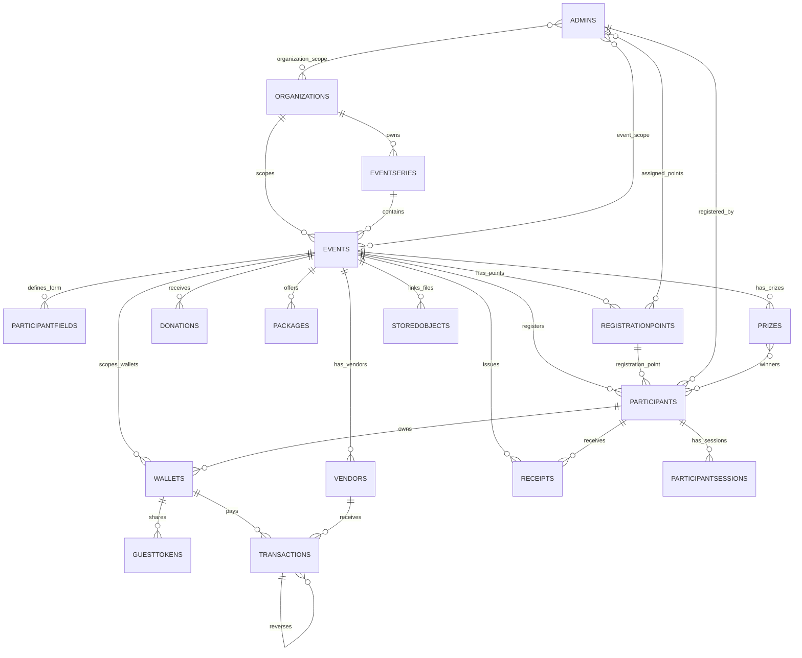
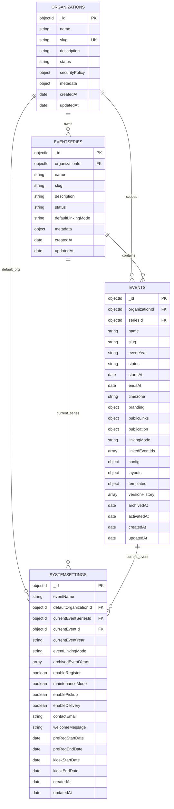
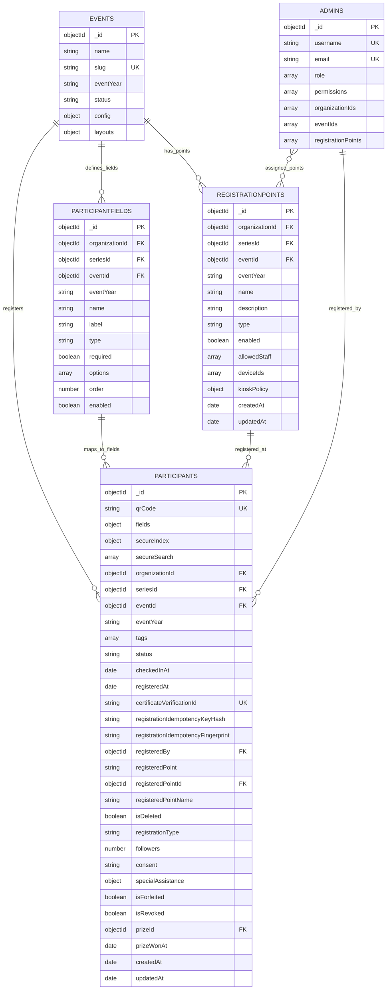
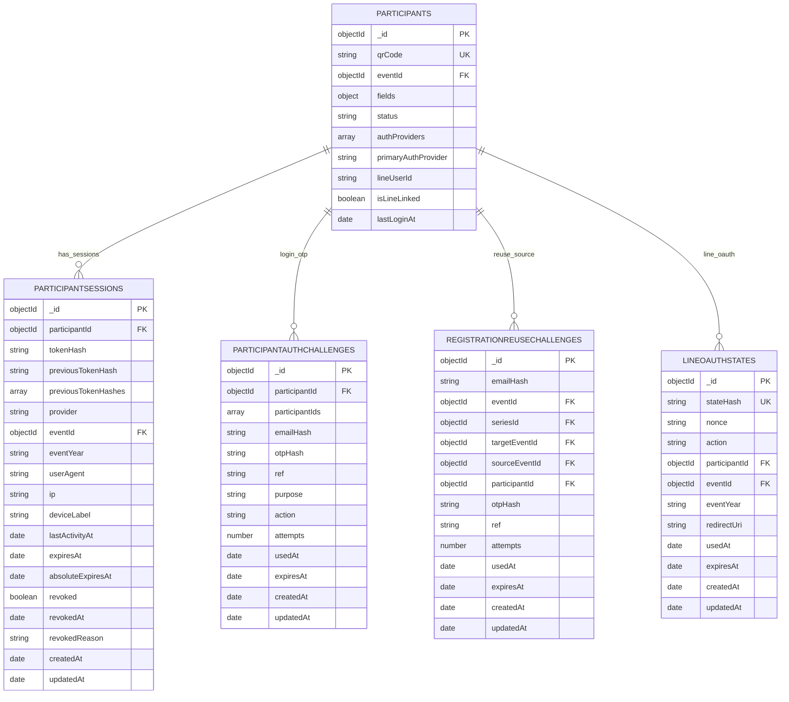
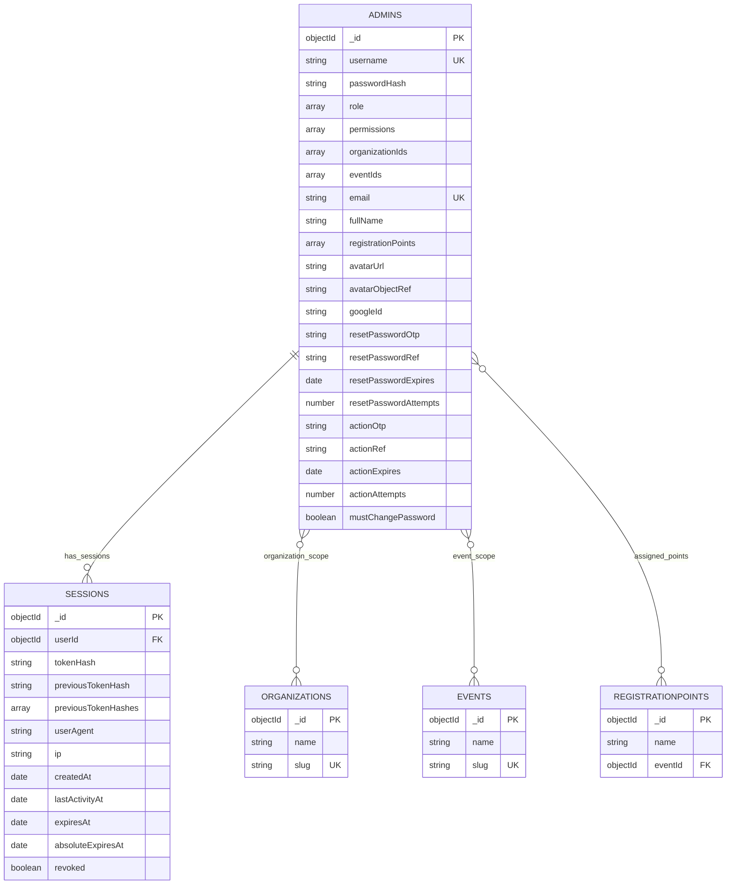
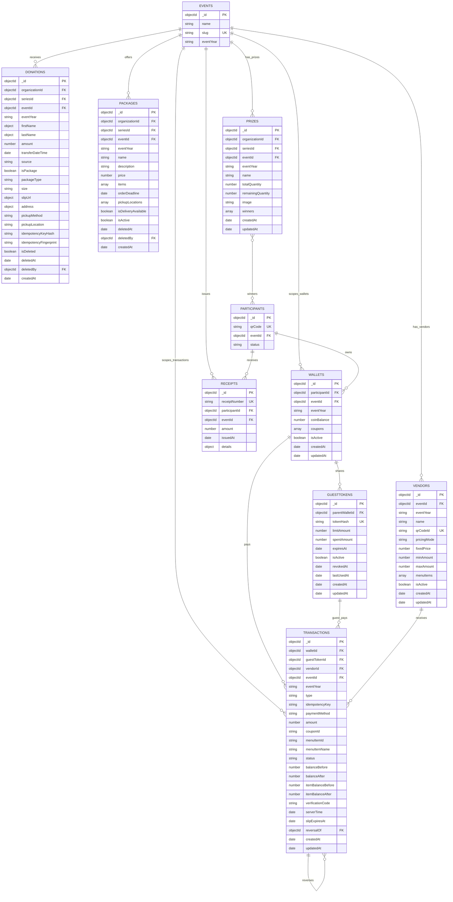
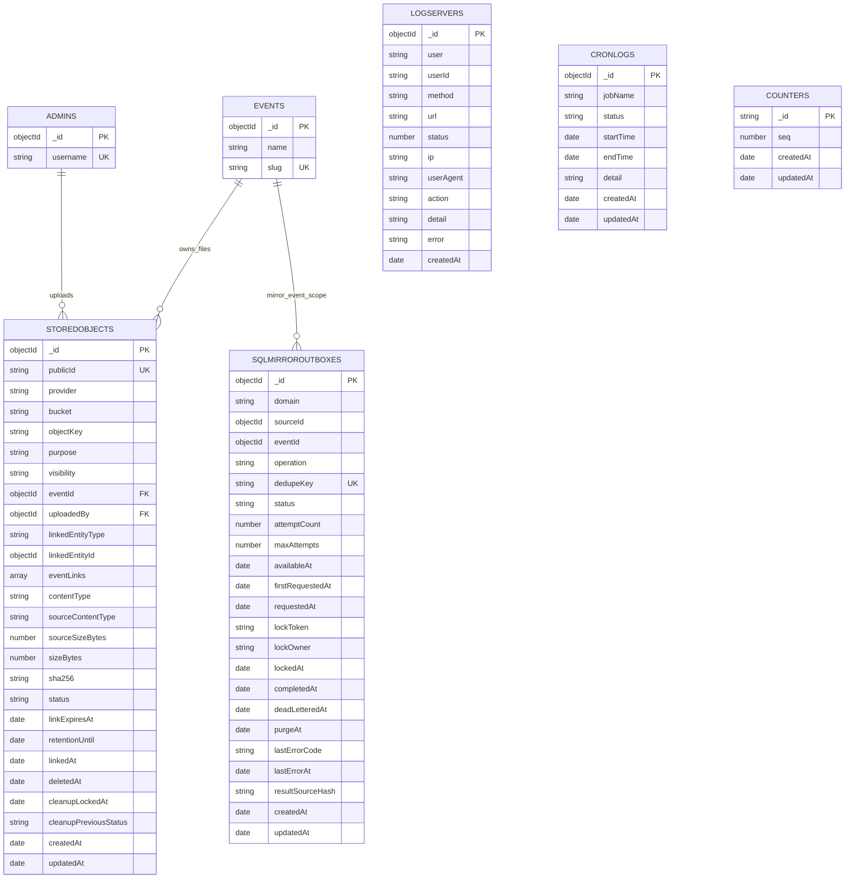

# Event System DBD

เอกสารนี้โฟกัสเฉพาะ Structure DB ของระบบอีเวนต์ก่อน ได้แก่ event setup, registration, participant, check-in, donation/package, lucky draw, wallet, receipt, storage, audit และ SQL reporting mirror

ไม่รวม POS/Inventory/PO เพราะเป็น phase ถัดไปและมีเอกสาร planned design แยกใน `docs/POS_INVENTORY_PRD.md`

## 1. Event System Overview

## 2. Event Setup DB

ใช้สำหรับสร้างหน่วยงาน ชุดกิจกรรม รอบกิจกรรม ตั้งค่า lifecycle, branding, feature flag และ layout

| Collection | เก็บข้อมูลอะไร |
|---|---|
| `organizations` | หน่วยงานเจ้าของ event และ security policy ระดับองค์กร |
| `eventseries` | ชุดกิจกรรม เช่น งานประจำปีที่มีหลายรอบ |
| `events` | รอบกิจกรรมจริง, public slug, status, branding, feature flags, layout, template |
| `systemsettings` | current/default event สำหรับ legacy/global views |

## 3. Registration and Check-In DB

ใช้สำหรับกำหนดฟอร์ม ลงทะเบียน public/staff/kiosk/self-register ส่ง e-ticket และเช็คอินด้วย QR

| Collection | เก็บข้อมูลอะไร |
|---|---|
| `participantfields` | field ที่ event ต้องการให้ผู้สมัครกรอก เช่น ชื่อ อีเมล เบอร์โทร ภาควิชา |
| `registrationpoints` | จุดหน้างาน, kiosk, self-register, check-in และ staff/device ที่ใช้ได้ |
| `participants` | ข้อมูลผู้ลงทะเบียน, QR code, status, check-in time, registration source |

## 4. Participant Identity and Session DB

ใช้สำหรับ participant login, OTP, LINE/LIFF, session, reuse registration จาก event เดิม

| Collection | เก็บข้อมูลอะไร |
|---|---|
| `participantsessions` | session ของ participant แบบ hash token |
| `participantauthchallenges` | OTP สำหรับ participant login และ step-up |
| `registrationreusechallenges` | OTP สำหรับดึงข้อมูลลงทะเบียนเดิม |
| `lineoauthstates` | state/nonce สำหรับ LINE login/link |

## 5. Admin and Permission DB

ใช้สำหรับผู้ดูแล เจ้าหน้าที่ permission และ session หลังบ้าน

| Collection | เก็บข้อมูลอะไร |
|---|---|
| `admins` | admin/staff/kiosk role, permission, scope, OTP action, avatar |
| `sessions` | session ของ admin/staff |

## 6. Event Operation DB

ใช้สำหรับ donation, package, lucky draw, wallet, vendor payment และ receipt

| Collection | เก็บข้อมูลอะไร |
|---|---|
| `donations` | รายการสนับสนุน โอนเงิน ซื้อ package แนบ slip และการรับ/จัดส่ง |
| `packages` | package/ของที่ระลึก/stock แบบ embedded สำหรับ pre-registration |
| `prizes` | ของรางวัลและ winners |
| `wallets` | wallet coin/coupon ของ participant |
| `guesttokens` | token ให้ guest ใช้ wallet |
| `vendors` | ร้านค้า/จุดรับชำระ wallet |
| `transactions` | payment/refund/reversal/topup ของ wallet |
| `receipts` | ใบเสร็จของ participant/event |

## 7. File, Audit, and Background DB

ใช้สำหรับไฟล์ event media/slip/avatar, audit log, cron log และ SQL mirror queue

| Collection | เก็บข้อมูลอะไร |
|---|---|
| `storedobjects` | metadata ของไฟล์ local/GCS เช่น logo, cover, payment slip, avatar |
| `sqlmirroroutboxes` | queue สำหรับ sync MongoDB ไป SQL reporting mirror |
| `logservers` | API/audit log พร้อม TTL |
| `cronlogs` | log งาน cron |
| `counters` | running sequence |

## 8. SQL Reporting Mirror for Event System

ใช้สำหรับรายงาน structured DB โดย MongoDB ยังเป็น source of truth

```mermaid
erDiagram
  organizations {
    bigint id PK
    string mongo_id UK
    string name
    string slug UK
    string status
    json security_policy_json
    datetime source_created_at
    datetime source_updated_at
    datetime mirrored_at
    string source_hash
  }

  event_series {
    bigint id PK
    string mongo_id UK
    bigint organization_id FK
    string name
    string slug
    string status
    string default_linking_mode
    datetime source_created_at
    datetime source_updated_at
    datetime mirrored_at
    string source_hash
  }

  events {
    bigint id PK
    string mongo_id UK
    bigint organization_id FK
    bigint series_id FK
    string name
    string slug
    string event_year
    string status
    datetime starts_at
    datetime ends_at
    string timezone
    string linking_mode
    datetime archived_at
    datetime activated_at
    datetime source_created_at
    datetime source_updated_at
    datetime mirrored_at
    string source_hash
  }

  participants_core {
    bigint id PK
    string mongo_id UK
    bigint organization_id FK
    bigint series_id FK
    bigint event_id FK
    string event_year
    string qr_code UK
    string status
    string registration_type
    string registered_point_name
    number followers
    string consent_status
    string email_blind_index
    string phone_blind_index
    string name_blind_index
    string line_user_blind_index
    boolean is_line_linked
    boolean is_deleted
    boolean is_revoked
    datetime registered_at
    datetime checked_in_at
    datetime source_updated_at
    datetime mirrored_at
    string source_hash
  }

  donation_summaries {
    bigint id PK
    string mongo_id UK
    bigint organization_id FK
    bigint series_id FK
    bigint event_id FK
    string event_year
    decimal amount
    datetime transfer_at
    string source
    boolean is_package
    string package_type
    string pickup_method
    boolean is_deleted
    datetime source_created_at
    datetime mirrored_at
    string source_hash
  }

  packages {
    bigint id PK
    string mongo_id UK
    bigint organization_id FK
    bigint series_id FK
    bigint event_id FK
    string event_year
    string name
    string description
    decimal price
    datetime order_deadline
    boolean is_delivery_available
    boolean is_active
    datetime deleted_at
    datetime source_created_at
    datetime mirrored_at
    string source_hash
  }

  package_items {
    bigint id PK
    bigint package_id FK
    number source_index
    string item_name
  }

  package_variants {
    bigint id PK
    bigint package_item_id FK
    number source_index
    string size_label
    bigint stock
    bigint sold
  }

  wallets {
    bigint id PK
    string mongo_id UK
    bigint participant_id FK
    bigint event_id FK
    string event_year
    string event_scope_key
    bigint coin_balance
    boolean is_active
    datetime source_created_at
    datetime source_updated_at
    datetime mirrored_at
    string source_hash
  }

  wallet_coupons {
    bigint id PK
    bigint wallet_id FK
    string coupon_id
    string name
    bigint quantity
    datetime mirrored_at
  }

  vendors {
    bigint id PK
    string mongo_id UK
    bigint event_id FK
    string event_year
    string name
    string qr_code_id UK
    string pricing_mode
    bigint fixed_price
    bigint min_amount
    bigint max_amount
    boolean is_active
    datetime source_created_at
    datetime source_updated_at
    datetime mirrored_at
    string source_hash
  }

  vendor_menu_items {
    bigint id PK
    bigint vendor_id FK
    number source_index
    string item_id
    string name
    bigint price
    boolean is_active
    datetime mirrored_at
  }

  wallet_transactions {
    bigint id PK
    string mongo_id UK
    bigint wallet_id FK
    bigint vendor_id FK
    bigint event_id FK
    string guest_token_mongo_id
    bigint reversal_of_id FK
    string transaction_type
    string idempotency_key
    string payment_method
    bigint amount
    string coupon_id
    string menu_item_id
    string status
    bigint balance_before
    bigint balance_after
    string verification_code
    datetime server_time
    datetime slip_expires_at
    datetime mirrored_at
    string source_hash
  }

  receipts {
    bigint id PK
    string mongo_id UK
    string receipt_number UK
    bigint participant_id FK
    bigint event_id FK
    decimal amount
    string details_hash
    datetime issued_at
    datetime mirrored_at
    string source_hash
  }

  organizations ||--o{ event_series : owns
  organizations ||--o{ events : scopes
  event_series ||--o{ events : contains
  organizations ||--o{ participants_core : scopes
  event_series ||--o{ participants_core : scopes
  events ||--o{ participants_core : registers
  organizations ||--o{ donation_summaries : scopes
  event_series ||--o{ donation_summaries : scopes
  events ||--o{ donation_summaries : receives
  organizations ||--o{ packages : scopes
  event_series ||--o{ packages : scopes
  events ||--o{ packages : offers
  packages ||--o{ package_items : has_items
  package_items ||--o{ package_variants : has_variants
  participants_core ||--o{ wallets : owns
  events ||--o{ wallets : scopes
  wallets ||--o{ wallet_coupons : has_coupons
  events ||--o{ vendors : has_vendors
  vendors ||--o{ vendor_menu_items : has_menu
  wallets ||--o{ wallet_transactions : pays
  vendors ||--o{ wallet_transactions : receives
  events ||--o{ wallet_transactions : scopes
  wallet_transactions ||--o{ wallet_transactions : reverses
  participants_core ||--o{ receipts : receives
  events ||--o{ receipts : issues
```

## 9. Event Go-Live Minimum DB

ตาราง/collection ขั้นต่ำที่ต้องมีข้อมูลก่อนเปิดลงทะเบียน:

| Required DB | ต้องมีอะไร |
|---|---|
| `organizations` | หน่วยงานเจ้าของ event |
| `eventseries` | ชุดกิจกรรม |
| `events` | event จริง, slug, status `registration_open`, feature registration เปิด |
| `participantfields` | field ที่ให้ผู้สมัครกรอก |
| `admins` | admin/staff พร้อม role, permission, event scope |
| `registrationpoints` | จุดลงทะเบียน ถ้าใช้ staff/kiosk/self-register/check-in |
| `systemsettings` | current/default event สำหรับหน้า legacy |
| `participants` | ผู้ลงทะเบียนจะถูกสร้างใน collection นี้ |
| `storedobjects` | logo/cover/slip/avatar metadata ถ้าใช้ managed upload |
| `participantauthchallenges` | ถ้าใช้ participant email OTP |
| `registrationreusechallenges` | ถ้าใช้ reuse registration |

