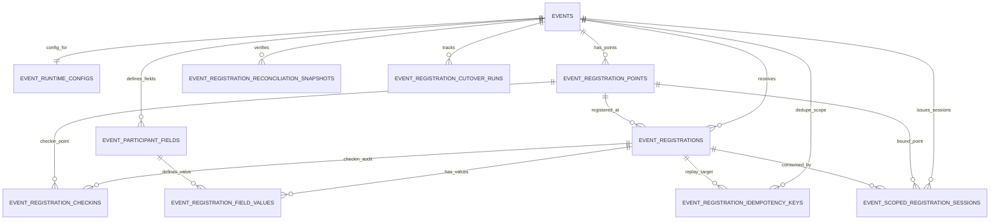

# MariaDB Event Registration Cutover

เอกสารนี้เป็นชุด migrate เฉพาะระบบลงทะเบียนอีเวนต์จาก MongoDB ไป MariaDB host จริง ไม่ต้องรัน SQL local

## เป้าหมาย

- MariaDB เป็น Structured DB เป้าหมายสำหรับ registration ของ Event
- Firestore ไม่ใช่ฐานหลัก ใช้ได้เฉพาะ optional realtime/payment-status mirror
- MongoDB ยังต้องเปิดอยู่ระหว่าง backfill และตรวจ reconciliation
- `SQL_PRIMARY_STORE=true` ยังห้ามเปิดจนกว่า runtime repository ของแต่ละ domain จะ switch ครบและผ่าน test

## ตารางที่เพิ่มสำหรับ Event Registration

| Table | เก็บข้อมูล |
| --- | --- |
| `event_runtime_configs` | public links, branding, feature flags, registration config, form layout, template ของ Event |
| `event_registration_points` | จุดลงทะเบียน/จุด kiosk/staff desk พร้อม policy, device และ staff binding |
| `event_participant_fields` | field ที่ใช้ในฟอร์มลงทะเบียนของ Event เช่น name/email/phone/options/required |
| `event_registrations` | record ผู้ลงทะเบียนหลัก, QR hash+encrypted QR, status, check-in, field payload encrypted, blind index |
| `event_registration_field_values` | ค่า dynamic field แบบ normalized ต่อ participant/field สำหรับค้นหาและตรวจ reconciliation |
| `event_registration_idempotency_keys` | ป้องกันการส่งลงทะเบียนซ้ำด้วย Idempotency-Key ต่อ Event |
| `event_registration_checkins` | audit การ check-in แต่ละครั้งจาก staff/kiosk/self-register |
| `event_scoped_registration_sessions` | short session ของ self-register/kiosk พร้อม expiry และ usedAt |
| `event_registration_reconciliation_snapshots` | count/checksum เทียบ Mongo กับ MariaDB หลัง backfill |
| `event_registration_cutover_runs` | run metadata ของ migration/cutover |



## ต้องเติมอะไรใน `.env`

จาก `.env` ที่มีอยู่ ตอนนี้ส่วน SQL ยังขาดค่าหลักคือชื่อ database/user/password ของ MariaDB จริง ให้เติม block นี้ใน `backend/.env` ไม่ใช่ `.env.example`

```env
SQL_ENABLED=true
SQL_DIALECT=mariadb
SQL_PROVIDER=plesk
SQL_HOST=203.170.190.137
SQL_EXPECTED_HOST=203.170.190.137
SQL_PORT=3306

SQL_DATABASE=<ชื่อฐานข้อมูลบนโฮสจริง>
SQL_USER=<runtime-user ของแอป>
SQL_PASSWORD=<runtime-password>
SQL_MIGRATION_USER=<migration-user ที่มีสิทธิ์ DDL>
SQL_MIGRATION_PASSWORD=<migration-password>
SQL_MIGRATION_ALLOW_RUNTIME_CREDENTIALS=false
SQL_REMOTE_MIGRATION_ONLY=true

# ถ้า Plesk ไม่มี CA และตอนนี้เป็น NODE_ENV=development:
SQL_SSL_MODE=disabled
SQL_SSL_CA=
SQL_SSL_CA_SECRET_NAME=

# เปิดเป็น true เฉพาะตอนรันคำสั่งเขียนจริงเท่านั้น
SQL_MIGRATION_WRITE=false
SQL_EVENT_REGISTRATION_BACKFILL_WRITE=false

# ยังไม่เปิดจนกว่า runtime cutover ผ่าน
SQL_PRIMARY_STORE=false
SQL_EVENT_REGISTRATION_PRIMARY=false
SQL_MIRROR_ENABLED=false
SQL_OUTBOX_ENABLED=false
```

ถ้า host รองรับ TLS แต่ไม่มี CA ให้ใช้ `SQL_SSL_MODE=required` แทน `disabled` ได้ใน development อย่าใส่ค่า placeholder เช่น `<PEM_CA_CERT>` สำหรับ Hostatom ปัจจุบัน probe วันที่ 2026-08-14 ยืนยันว่า endpoint ไม่ advertise TLS และผู้ให้บริการไม่มี IP allowlist เจ้าของระบบจึงอนุมัติ production exception เฉพาะ endpoint `203.170.190.137:3306` โดยตั้ง `SQL_SSL_MODE=disabled`, `SQL_ALLOW_INSECURE_PRODUCTION=true` และใช้ runtime user สิทธิ์ต่ำ

## ลำดับ migrate ไป host จริง

```bash
cd backend
npm run audit:sql-primary-cutover
npm run migrate:sql-schema
SQL_MIGRATION_WRITE=true npm run migrate:sql-schema -- --apply
npm run audit:sql-primary-cutover -- --connect
npm run backfill:sql-event-registration -- --event-id=<mongo-event-id>
SQL_EVENT_REGISTRATION_BACKFILL_WRITE=true npm run backfill:sql-event-registration -- --apply --event-id=<mongo-event-id>
```

คำสั่ง `migrate:sql-schema` สร้าง table เท่านั้น ส่วน `backfill:sql-event-registration` ย้ายข้อมูล registration ของ Event นั้นจาก MongoDB เข้า MariaDB และเขียน reconciliation snapshot

## เปิด runtime เฉพาะ Event Registration

หลัง schema/backfill/reconciliation ผ่านแล้ว สามารถเปิด read/write path ของระบบลงทะเบียนอีเวนต์ให้ใช้ MariaDB ได้ด้วย flag แยก:

```env
SQL_ENABLED=true
SQL_PRIMARY_STORE=false
SQL_EVENT_REGISTRATION_PRIMARY=true
SQL_SSL_MODE=disabled
SQL_SSL_CA_SECRET_NAME=
SQL_ALLOW_INSECURE_PRODUCTION=true
SQL_STATIC_EGRESS_ENABLED=false
SQL_NETWORK_ALLOWLIST_CONFIRMED=false
```

`SQL_PRIMARY_STORE` ยังต้องเป็น `false` เพราะ domain อื่น เช่น auth/session/system settings/wallet/prize ยังไม่ถูก cutover ทั้งหมด Flag นี้ครอบคลุมเฉพาะ:

- participant fields
- registration points
- public/staff/onsite participant registration
- participant list/search/update/delete/export
- QR check-in
- resend ticket lookup

ก่อนเปิดจริงให้ตรวจ read path:

```bash
SQL_EVENT_REGISTRATION_PRIMARY=true node -e "require('dotenv').config(); process.env.SQL_EVENT_REGISTRATION_PRIMARY='true'; const {connectSQL, closeSQL}=require('./src/config/sql'); const repo=require('./src/sql/eventRegistrationRepository'); (async()=>{ await connectSQL(); const context={eventId:'<mongo-event-id>', eventYear:'<event-year>'}; console.log({ fields:(await repo.listParticipantFields(context,{enabledOnly:true})).length, points:(await repo.listRegistrationPoints(context,{enabledOnly:true})).length, participants:(await repo.listParticipants(context)).length }); await closeSQL(); })().catch(async e=>{ console.error(e); await closeSQL().catch(()=>{}); process.exit(1); });"
```
