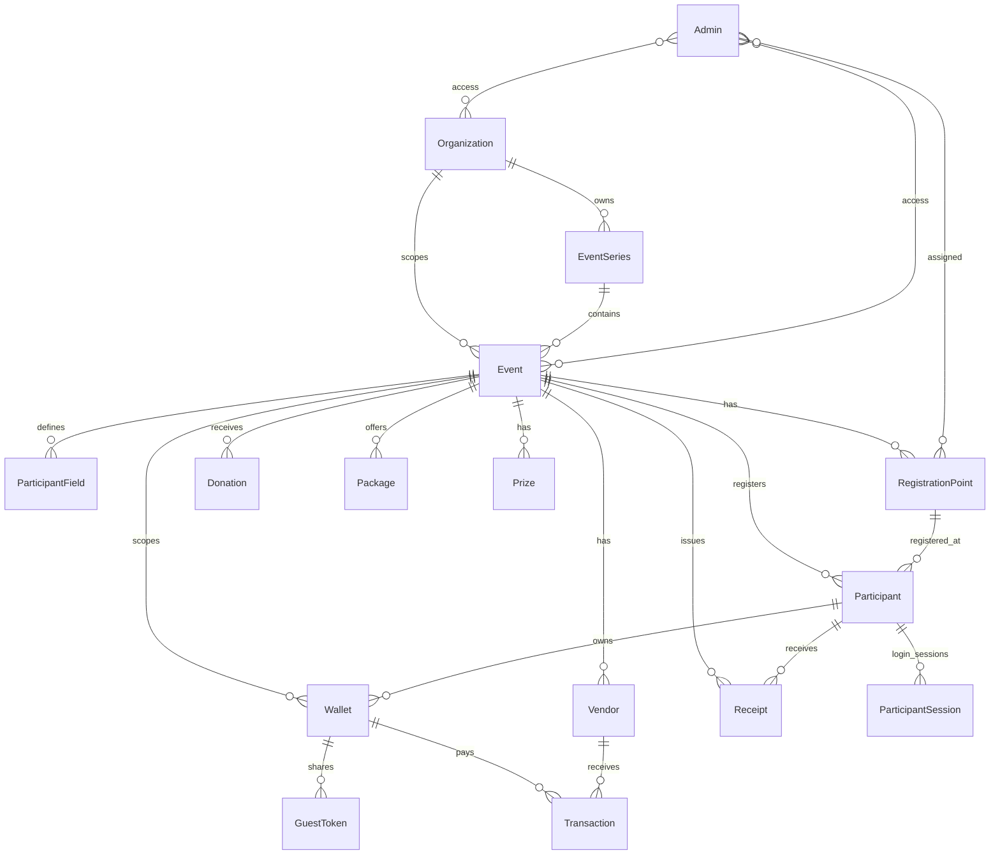
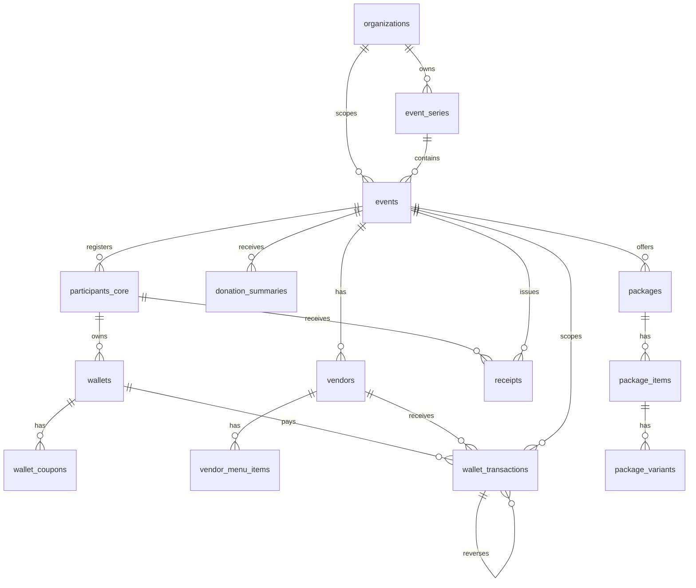
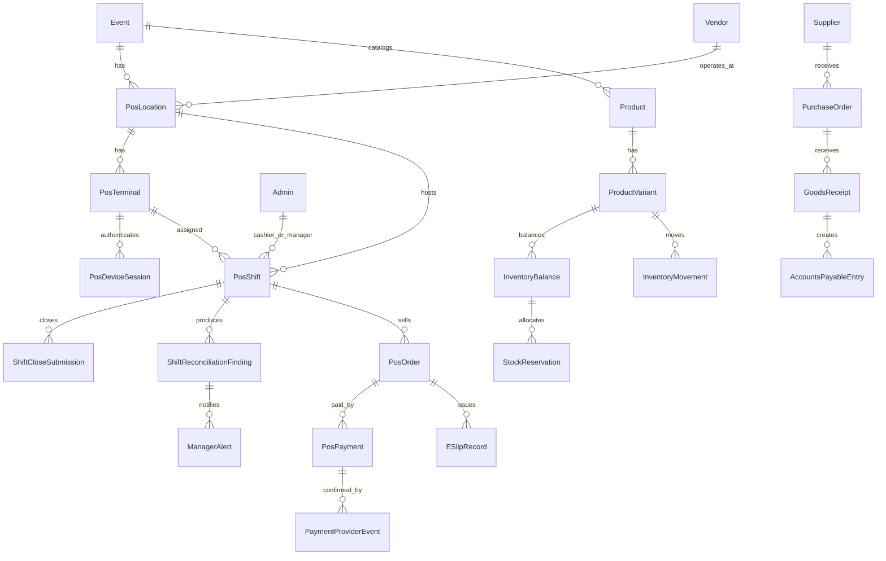

# Planned Structure DB

เอกสารนี้คือ Structure DB ที่วางไว้/ออกแบบไว้สำหรับระบบ PSEvent โดยแยกสถานะของแต่ละกลุ่มข้อมูลให้ชัดเจน

ถ้าต้องการเอกสาร DBD ที่โฟกัสเฉพาะระบบอีเวนต์/ลงทะเบียนก่อน ให้เริ่มจาก `docs/EVENT_SYSTEM_DBD.md`

ถ้าต้องการดูว่าแต่ละ table/collection เก็บข้อมูลอะไรและ field แต่ละตัวหมายถึงอะไร ให้ดู data dictionary แยกที่ `docs/DBD_TABLE_DICTIONARY.md`

ถ้าต้องการ Mermaid code สำหรับนำไป render เป็น DBD/ERD ให้ดู `docs/DBD_MERMAID.md`

- `Implemented design`: มี model/route/controller รองรับแล้วใน codebase
- `Reporting mirror design`: วางเป็น structured SQL สำหรับรายงาน แต่ MongoDB ยังเป็น source of truth
- `Planned design`: มี PRD/roadmap ออกแบบไว้แล้ว แต่ยังไม่พบ implementation ครบใน code path ปัจจุบัน

แหล่งอ้างอิงหลัก:

- `backend/src/models/*.js`
- `backend/src/sql/migrations/001_initial_reporting_mirror.js`
- `docs/MULTI_EVENT_E2EE_ROADMAP.md`
- `docs/HYBRID_DB_MIGRATION_PLAN.md`
- `docs/POS_INVENTORY_PRD.md`

## 1. Target Architecture

```text
MongoDB
  = Operational source of truth
  = รับ write หลักของ registration, event, wallet, package, POS ใน phase แรก

SSO/Identity
  = Boundary กลางของ login, session, permission claim, step-up auth และ revoke
  = Event System และ POS System ใช้งานร่วมกันได้ แต่ต้องตรวจ authorization ของตนเอง

Event System / POS System
  = แยก bounded context กันชัดเจน
  = ใช้ shared contract ผ่าน eventId, organizationId, permission claim, audit log, notification และ reporting mirror

MariaDB/MySQL
  = Structured reporting mirror
  = ใช้ join/report/BI หลัง backfill + reconciliation ผ่าน
  = ไม่ใช่ primary write path ใน phase ปัจจุบัน

GCS/Object Storage
  = เก็บไฟล์ canonical เช่น event media, payment slip, e-slip
  = MongoDB เก็บ metadata/object reference เท่านั้น

Notification Provider
  = Brevo Transactional Email API เป็น email provider หลัก
  = LINE Messaging API เป็น optional channel
  = SMTP ใช้เฉพาะ fallback/local compatibility ที่อนุมัติ
```

## 2. Core Event and Registration Structure

สถานะ: `Implemented design`



### 2.1 Organization

เจ้าของระบบ/หน่วยงานหลัก

| Field | Type | Note |
|---|---|---|
| `_id` | ObjectId | primary id |
| `name` | String | ชื่อหน่วยงาน |
| `slug` | String unique | public/internal key |
| `description` | String | รายละเอียด |
| `status` | `active`, `archived` | lifecycle |
| `securityPolicy` | Mixed | MFA/audit/public registration policy |
| `metadata` | Mixed | custom metadata |
| `createdAt`, `updatedAt` | Date | timestamps |

### 2.2 EventSeries

ชุดกิจกรรมต่อเนื่อง เช่น งานประจำปี

| Field | Type | Note |
|---|---|---|
| `_id` | ObjectId | primary id |
| `organizationId` | ObjectId ref `Organization` | owner scope |
| `name` | String | ชื่อชุดกิจกรรม |
| `slug` | String | unique ต่อ organization |
| `description` | String | รายละเอียด |
| `status` | `active`, `archived` | lifecycle |
| `defaultLinkingMode` | `isolated`, `series-linked`, `manual-linked` | วิธีเชื่อมข้อมูลข้าม event |
| `metadata` | Mixed | custom metadata |
| `createdAt`, `updatedAt` | Date | timestamps |

### 2.3 Event

รอบกิจกรรมจริง เช่น ปี 2026

| Field | Type | Note |
|---|---|---|
| `_id` | ObjectId | primary id |
| `organizationId` | ObjectId ref `Organization` | owner scope |
| `seriesId` | ObjectId ref `EventSeries` | series scope |
| `name` | String | ชื่องาน |
| `slug` | String | public route `/e/:slug` |
| `eventYear` | String | compatibility/report field |
| `status` | `draft`, `published`, `registration_open`, `registration_closed`, `event_day`, `archived` | lifecycle |
| `startsAt`, `endsAt` | Date | วันเริ่ม/จบ |
| `timezone` | String | default `Asia/Bangkok` |
| `branding` | Object | `logoUrl`, `coverImageUrl`, theme colors |
| `publicLinks` | Object | landing/register/checkin/report path |
| `publication` | Object | publish/open/close/consent config |
| `linkingMode` | String | event linking mode |
| `linkedEventIds` | ObjectId[] ref `Event` | manual linked events |
| `config` | Mixed | feature flags, register windows, welcome/contact |
| `layouts` | Object | landing, registration form, dashboard, ticket, report |
| `templates` | Mixed | email/report template |
| `versionHistory` | Array | published layout/event snapshots |
| `archivedAt`, `activatedAt` | Date | lifecycle timestamps |

### 2.4 ParticipantField

Dynamic fields ของฟอร์มลงทะเบียน

| Field | Type | Note |
|---|---|---|
| `_id` | ObjectId | primary id |
| `organizationId`, `seriesId`, `eventId` | ObjectId refs | scope |
| `eventYear` | String | legacy/report scope |
| `name` | String | field key |
| `label` | String | label บนฟอร์ม |
| `type` | `text`, `email`, `number`, `select`, `date` | input type |
| `required` | Boolean | required rule |
| `options` | String[] | options สำหรับ select |
| `order` | Number | display order |
| `enabled` | Boolean | เปิด/ปิด field |

### 2.5 RegistrationPoint

จุดลงทะเบียน, staff point, kiosk, self-register และ check-in point

| Field | Type | Note |
|---|---|---|
| `_id` | ObjectId | primary id |
| `organizationId`, `seriesId`, `eventId` | ObjectId refs | scope |
| `eventYear` | String | legacy/report scope |
| `name` | String | ชื่อจุด |
| `description` | String | รายละเอียด |
| `type` | `onsite`, `meeting`, `kiosk`, `self_register`, `checkin`, `other` | point type |
| `enabled` | Boolean | เปิดใช้งาน |
| `allowedStaff` | ObjectId[] ref `Admin` | staff ที่ใช้จุดนี้ได้ |
| `deviceIds` | String[] | device allowlist |
| `kioskPolicy` | Object | camera/fullscreen/idle/success reset policy |
| `createdAt`, `updatedAt` | Date | timestamps |

### 2.6 Participant

ผู้เข้าร่วม/ผู้ลงทะเบียน

| Field | Type | Note |
|---|---|---|
| `_id` | ObjectId | primary id |
| `qrCode` | String unique | ticket/check-in key |
| `fields` | Object | dynamic registration data |
| `secureIndex` | Object | blind index สำหรับ field ที่ปกป้อง |
| `secureSearch` | String[] | secure search token |
| `organizationId`, `seriesId`, `eventId` | ObjectId refs | event scope |
| `eventYear` | String | legacy/report scope |
| `tags` | String[] | tags |
| `status` | `registered`, `checkedIn`, `cancelled` | registration/check-in state |
| `registeredAt`, `checkedInAt` | Date | timestamps |
| `certificateVerificationId` | String | opaque verify id |
| `registrationIdempotencyKeyHash` | String | replay protection |
| `registeredBy` | ObjectId ref `Admin` | staff/admin actor |
| `registeredPointId` | ObjectId ref `RegistrationPoint` | point |
| `registeredPointName` | String | denormalized point name |
| `registrationType` | `online`, `onsite`, `onsite_staff`, `onsite_kiosk`, `self_register` | source |
| `followers` | Number | จำนวนผู้ติดตาม |
| `consent` | `agreed`, `disagreed`, null | consent |
| `specialAssistance` | Mixed | assistance data |
| `prizeId` | ObjectId ref `Prize` | prize won |
| `authProviders` | String[] | email/line/google |
| `lineUserId` | String | LINE link id |
| `trustedDevices` | Mixed[] | trusted device metadata |
| `notificationPreferences` | Object | line/email/coupon/checkin/certificate prefs |

### 2.7 Admin and Access

| Collection | Purpose | Key fields |
|---|---|---|
| `admins` | ผู้ดูแล/เจ้าหน้าที่ | `username`, `email`, `role`, `permissions`, `organizationIds`, `eventIds`, `registrationPoints`, OTP fields |
| `sessions` | admin sessions | `userId`, `tokenHash`, `expiresAt`, `revoked` |
| `participantsessions` | participant sessions | `participantId`, `eventId`, `provider`, `expiresAt`, `revoked` |
| `participantauthchallenges` | email OTP login/step-up | `participantId`, `participantIds`, `emailHash`, `purpose`, `expiresAt` |
| `registrationreusechallenges` | reuse registration OTP | `targetEventId`, `sourceEventId`, `participantId`, `emailHash`, `expiresAt` |
| `lineoauthstates` | LINE OAuth state | `stateHash`, `nonce`, `action`, `participantId`, `eventId`, `expiresAt` |

## 3. Event Commerce and Engagement Structure

สถานะ: `Implemented design`

| Collection | Purpose | Key fields | Relationship |
|---|---|---|---|
| `donations` | เงินสนับสนุน/รายการ package purchase | `eventId`, `amount`, `transferDateTime`, `source`, `isPackage`, `packageType`, `size`, `slipUrl`, `pickupMethod`, `idempotencyKeyHash` | belongs to Event |
| `packages` | package/stock แบบเดิมสำหรับ pre-registration | `eventId`, `name`, `price`, `items.sizes.stock`, `items.sizes.sold`, `orderDeadline`, `pickupLocations` | belongs to Event |
| `prizes` | lucky draw prize | `eventId`, `name`, `totalQuantity`, `remainingQuantity`, `winners.participantId` | belongs to Event, Participant |
| `wallets` | coin/coupon wallet | `participantId`, `eventId`, `coinBalance`, `coupons` | belongs to Participant/Event |
| `guesttokens` | share wallet token | `parentWalletId`, `tokenHash`, `limitAmount`, `spentAmount`, `expiresAt` | belongs to Wallet |
| `vendors` | vendor/menu สำหรับ wallet payment | `eventId`, `qrCodeId`, `pricingMode`, `fixedPrice`, `menuItems` | belongs to Event |
| `transactions` | wallet payment/refund/reversal | `walletId`, `vendorId`, `guestTokenId`, `eventId`, `type`, `paymentMethod`, `amount`, `reversalOf` | belongs to Wallet/Vendor/Event |
| `receipts` | receipt | `receiptNumber`, `participantId`, `eventId`, `amount`, `issuedAt` | belongs to Participant/Event |

หมายเหตุ: `packages.items.sizes.stock/sold` เป็นโครงเดิมสำหรับ package pre-registration เท่านั้น ตาม POS PRD ห้ามนำไปใช้เป็น inventory ledger ของ POS โดยตรง

## 4. Storage, Audit, and System Structure

สถานะ: `Implemented design`

| Collection | Purpose | Key fields |
|---|---|---|
| `storedobjects` | metadata ของไฟล์ local/GCS | `publicId`, `provider`, `purpose`, `visibility`, `eventId`, `uploadedBy`, `linkedEntityType`, `linkedEntityId`, `eventLinks`, `sha256`, `status`, `retentionUntil` |
| `systemsettings` | global/current event compatibility | `defaultOrganizationId`, `currentEventSeriesId`, `currentEventId`, `currentEventYear`, `enableRegister`, windows |
| `sqlmirroroutboxes` | live mirror queue | `domain`, `sourceId`, `eventId`, `operation`, `dedupeKey`, `status`, retry/lock fields |
| `logservers` | API/audit log | `user`, `userId`, `method`, `url`, `status`, `action`, `createdAt` |
| `cronlogs` | cron execution log | `jobName`, `status`, `startTime`, `endTime`, `detail` |
| `counters` | atomic counters | `_id`, `seq` |

## 5. SQL Reporting Mirror Structure

สถานะ: `Reporting mirror design`



| SQL table | Purpose | Source Mongo model |
|---|---|---|
| `organizations` | organization dimension | `Organization` |
| `event_series` | event series dimension | `EventSeries` |
| `events` | event dimension | `Event` |
| `participants_core` | participant core metadata แบบไม่เก็บ plaintext PII | `Participant` |
| `wallets` | wallet summary | `Wallet` |
| `wallet_coupons` | embedded coupons projection | `Wallet.coupons` |
| `vendors` | vendor dimension | `Vendor` |
| `vendor_menu_items` | embedded menu projection | `Vendor.menuItems` |
| `wallet_transactions` | wallet payment/refund/reversal fact | `Transaction` |
| `receipts` | receipt summary | `Receipt` |
| `donation_summaries` | donation/package summary | `Donation` |
| `packages` | package summary | `Package` |
| `package_items` | embedded item projection | `Package.items` |
| `package_variants` | embedded size/stock/sold projection | `Package.items.sizes` |
| `mirror_backfill_checkpoints` | backfill checkpoint | migration runtime |
| `schema_migrations` | SQL migration history | migration runtime |

## 6. Planned POS and Inventory Structure

สถานะ: `Planned design` จาก `docs/POS_INVENTORY_PRD.md`; ยังไม่ใช่ model/routes ที่พร้อมใช้ production



### 6.1 POS Location, Terminal, Device

| Planned collection | Purpose | Planned key fields |
|---|---|---|
| `PosLocations` | จุดขาย/คลังย่อยใน event | `organizationId`, `eventId`, `vendorId`, `name`, `code`, `status`, `timezone`, `cashPolicy`, `negativeStockPolicy` |
| `PosTerminals` | เครื่องขาย/terminal | `organizationId`, `eventId`, `locationId`, `vendorId`, `terminalCode`, `deviceId`, `status`, `lastSeenAt` |
| `PosDeviceSessions` | session ของ device/terminal | `terminalId`, `deviceId`, `userId`, `shiftId`, `status`, `tokenVersion`, `expiresAt`, `revokedAt` |

### 6.2 Shift and Reconciliation

| Planned collection | Purpose | Planned key fields |
|---|---|---|
| `PosShifts` | กะขาย | `organizationId`, `eventId`, `vendorId`, `locationId`, `terminalId`, `cashierId`, `managerId`, `status`, `businessDate`, `cashFloatMinor`, `cashPolicy`, `openedAt`, `acknowledgedAt`, `submittedAt`, `approvedAt`, `version` |
| `ShiftCloseSubmissions` | blind close declaration | `shiftId`, `submittedBy`, `denominations`, `declaredCashMinor`, `declaredFloatMinor`, `declaredPromptPayAmountMinor`, `declaredCardAmountMinor`, `manifestSummary`, `status`, `version`, `submittedAt` |
| `ShiftReconciliationFindings` | mismatch/exception queue | `shiftId`, `code`, `severity`, `amountDeltaMinor`, `countDelta`, `ownerId`, `status`, `dueDate`, `resolvedAt`, `resolutionNote` |

State machine ที่ออกแบบไว้:

```text
DRAFT -> OPEN_PENDING_ACK -> OPEN -> CLOSING -> SUBMITTED
      -> REVIEW_REQUIRED -> APPROVED -> CLOSED
```

### 6.3 Product and Inventory Ledger

| Planned collection | Purpose | Planned key fields |
|---|---|---|
| `Products` | catalog สินค้า | `organizationId`, `eventId`, `vendorId`, `name`, `category`, `status`, `taxPolicy`, `metadata` |
| `ProductVariants` | SKU/variant | `productId`, `sku`, `barcode`, `name`, `priceMinor`, `costMinor`, `unit`, `trackStock`, `stockPolicy`, `status`, `version` |
| `InventoryBalances` | materialized balance | `organizationId`, `eventId`, `locationId`, `variantId`, `onHandQty`, `allocatedQty`, `availableQty`, `version`, `updatedAt` |
| `InventoryMovements` | immutable movement ledger | `organizationId`, `eventId`, `locationId`, `variantId`, `type`, `quantityDelta`, `unit`, `sourceType`, `sourceId`, `actorId`, `reason`, `idempotencyKeyHash`, `createdAt` |
| `StockReservations` | soft allocation | `organizationId`, `eventId`, `locationId`, `variantId`, `sourceType`, `sourceId`, `quantity`, `status`, `expiresAt`, `committedAt`, `releasedAt` |

Movement type ขั้นต่ำ:

```text
OPENING, PURCHASE_RECEIPT, SALE, SALE_REVERSAL, RETURN,
TRANSFER_OUT, TRANSFER_IN, ADJUSTMENT, DAMAGE, RESERVATION_COMMIT
```

หลักการออกแบบ: stock ห้ามใช้ field เดี่ยวเป็นหลักฐานย้อนหลัง ต้องใช้ immutable movement ledger และให้ `InventoryBalances` เป็น projection ที่ rebuild ตรวจ drift ได้

### 6.4 POS Order, Payment, E-Slip

| Planned collection | Purpose | Planned key fields |
|---|---|---|
| `PosOrders` | order/cart/checkout | `organizationId`, `eventId`, `vendorId`, `locationId`, `terminalId`, `shiftId`, `cashierId`, `orderNumber`, `businessDate`, `status`, `lines`, `totalMinor`, `currency`, `pricingPolicyVersion`, `hasNegativeStockOverride`, `idempotencyKeyHash`, `version` |
| `PosPayments` | payment attempt/result | `orderId`, `provider`, `paymentMethod`, `status`, `amountMinor`, `currency`, `providerPaymentId`, `estimatedFeeMinor`, `actualFeeMinor`, `netSettlementMinor`, `paidAt`, `idempotencyKeyHash` |
| `PaymentProviderEvents` | webhook/provider evidence | `provider`, `providerEventId`, `paymentId`, `orderId`, `payloadHash`, `status`, `receivedAt`, `processedAt`, `dedupeKey` |
| `ESlipRecords` | canonical e-slip metadata | `organizationId`, `eventId`, `orderId`, `paymentId`, `receiptNumber`, `verificationId`, `objectRef`, `checksum`, `objectGeneration`, `status`, `issuedAt` |

`PosOrders.lines` ต้อง snapshot ชื่อสินค้า, SKU, ราคา, discount, tax และ net line ตอนขาย เพื่อไม่ให้การแก้ catalog ย้อนหลังเปลี่ยนรายงานเก่า

Order state machine ที่ออกแบบไว้:

```text
DRAFT -> CHECKOUT_PENDING -> PAYMENT_PENDING -> PAID -> FULFILLED
                  |              |       -> PARTIALLY_REFUNDED -> REFUNDED
                  +-> CANCELLED  +-> PAYMENT_FAILED/EXPIRED
```

### 6.5 Supplier, PO, Goods Receipt, AP

| Planned collection | Purpose | Planned key fields |
|---|---|---|
| `Suppliers` | supplier master | `organizationId`, `name`, `code`, `contact`, `taxId`, `status`, `secureIndex`, `metadata` |
| `PurchaseOrders` | PO | `organizationId`, `eventId`, `locationId`, `supplierId`, `poNumber`, `status`, `currency`, `lines`, `orderedAmountMinor`, `approvedBy`, `approvedAt`, `expectedDate`, `version` |
| `GoodsReceipts` | partial/full receiving | `purchaseOrderId`, `organizationId`, `eventId`, `locationId`, `supplierDocumentNo`, `lines`, `receivedBy`, `receivedAt`, `status`, `idempotencyKeyHash` |
| `AccountsPayableEntries` | payable จาก accepted goods | `supplierId`, `purchaseOrderId`, `goodsReceiptId`, `invoiceNo`, `status`, `totalPayableAmountMinor`, `paidAmountMinor`, `dueDate`, `createdAt` |

PO state machine ที่ออกแบบไว้:

```text
DRAFT -> APPROVED -> SENT -> PARTIALLY_RECEIVED -> FULLY_RECEIVED -> CLOSED
                       |                 +-> CLOSED (force close)
                       +-> CANCELLED
```

AP ต้องตั้งจาก accepted quantity จริงเท่านั้น:

```text
linePayable = acceptedQuantity * lockedUnitCost
totalPayable = sum(linePayable) + allocatedAcceptedCharges
             + acceptedTax - acceptedDiscount
```

### 6.6 Alert and Idempotency

| Planned collection | Purpose | Planned key fields |
|---|---|---|
| `ManagerAlerts` | alert queue/dashboard/LINE Messaging API | `organizationId`, `eventId`, `severity`, `code`, `sourceType`, `sourceId`, `recipientAdminId`, `channel`, `status`, `dedupeKey`, `createdAt`, `sentAt` |
| `IdempotencyRecords` | generic write/retry protection | `scope`, `keyHash`, `requestHash`, `aggregateType`, `aggregateId`, `status`, `responseSummary`, `expiresAt`, `createdAt` |

## 7. Planned Security and E2EE Data Contract

สถานะ: `Planned design / progressive migration`

Roadmap วางแนวทางไว้ว่า private data ต้องขยับจาก server-side field encryption ไปสู่ true E2EE ใน event ใหม่บางส่วน

| Design item | Planned structure |
|---|---|
| encrypted field payload | เก็บ ciphertext/envelope metadata ใน field value หรือ object ย่อย |
| blind index | เก็บ `secureIndex` สำหรับค้นหาโดยไม่เก็บ plaintext |
| secure search | เก็บ token ใน `secureSearch` |
| key metadata | เก็บ `keyId`, encryption version, algorithm metadata ต่อ encrypted payload |
| client-side decrypt/export | report/export/PDF decrypt ฝั่ง client หลัง admin unlock key |
| audit | ทุก decrypt/export/rotate ต้องเขียน sensitive audit log |

ยังไม่มีการออกแบบ collection แยกที่สรุปชัดสำหรับ true E2EE key grant ในเอกสารปัจจุบัน จึงควรปิดแบบ schema เพิ่มก่อนเริ่ม implementation

## 8. Registration Launch Minimal DB

ถ้าเป้าหมายคือเปิดลงทะเบียนก่อน โครงสร้างขั้นต่ำที่ต้องมีข้อมูลจริงคือ:

1. `organizations`
2. `eventseries`
3. `events` พร้อม `status=registration_open`
4. `participantfields`
5. `registrationpoints` เฉพาะกรณี staff/kiosk/self-register
6. `admins` พร้อม role/permission/scope
7. `systemsettings` สำหรับ current/default event compatibility
8. `participants` สำหรับข้อมูลลงทะเบียน
9. `storedobjects` หากใช้ logo/cover/slip ผ่าน managed storage
10. `participantauthchallenges` และ `registrationreusechallenges` หากใช้ OTP/reuse

กลุ่ม POS/Inventory/PO ยังไม่จำเป็นต่อการเปิด registration และควรแยกเป็น phase หลัง registration flow ผ่าน production smoke test แล้ว
